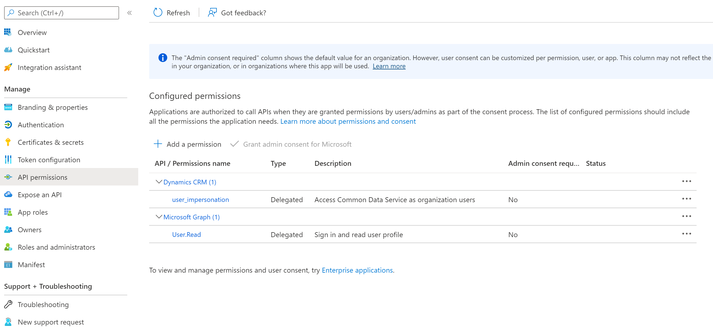

# Dataverse load test
This repository contains a Python script which can used for loading a Dataverse table with dummy entries for performance testing. It does so by leveraging the [Dataverse Web API](https://docs.microsoft.com/en-us/power-apps/developer/data-platform/webapi/overview).

# Prerequisites
- A Python 3 runtime.
- A Power Platform environment with the permissions to create and modify Dataverse tables.
- An AAD service principal is needed with `Dynamics CRM user_impersonation` permissions. Switch to the AAD App registrations tab and select "New registration". Name your service principal and note down the tenant and client ID. Go to "Manifest" and set `"allowPublicClient": true`. Next go to "Certificates & secrets" and set a secret - note it down. Finally go to "API permissions", click "Add permission", search for "Dynamics CRM" and add a delegated "user_impersonation" permission.<p><br/>

</p>

# Usage
Add "--help" to get more information about arguments, for example
```console
user@com:~$ python dataverse_loadtest.py create dataversetable --help
```
returns additional information on how to create new Dataverse tables.

## Create a table in Dataverse
Replace the placeholders below with your data ("orgcd1abe55" is the Dynamics instance you must adopt to your needs, "cr876_" is the schema prefix used for the table and all columns) and run the script the following command:

```console
user@com:~$ python dataverse_loadtest.py create dataversetable -t <AAD tenant> -i <AAD Client ID> -p <AAD Client secret> -o "orgcd1abe55" -s "cr876_" -n <Table Name>
```

This will create a table named `<Table Name>` in Dataverse.

## Fill the table with data
Replace the placeholders below with your data to fill the previously created table with data. If you run the subsequent command, 10 rows will be added containing dummy data.
```console
user@com:~$ python dataverse_loadtest.py fill -t <AAD tenant> -i <AAD Client ID> -p <AAD Client secret> -o "orgcd1abe55" -s "cr876_" -n <Table Name> --assignee_email "youremail@yourorg.com" --no_of_entries 10
```
